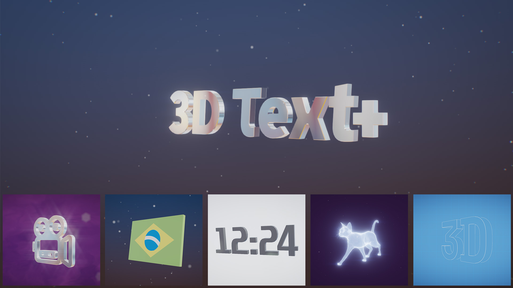
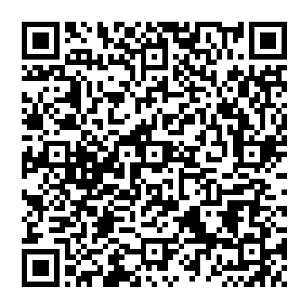

# 3D Text+ Screensaver



> **I don't have any life left to waste waiting for Microsoft to update the "3D Text" screensaver—and neither do you.**

What started as a personal itch is now a fully featured, modernized screensaver built for today's hardware.

---

## The Story

I've always missed classic screensavers. Back in the early days of Windows, they were an experience of their own—**3D Pipes, 3D Maze, Starfield**, and more. Today, those options have shrunk, but legacy code remains. The reflection map on Windows' default *3D Text* is still a pixelated 256x256 image from decades ago, and it really shows on modern high-resolution displays.

I needed something better: a screensaver where I could:
- Control the rotation angle (without text rendering backward/flipped).
- Tweak material types, colors, and textures.
- Adjust scale, add new visual effects, and set custom backgrounds.
- **Most importantly:** Upload custom logos or 3D meshes.

A task like this should be simple for modern hardware, yet default system tools haven't caught up. So, **3D Text+** was born.

---

## How It Was Built

Since I don't write C++ manually, I teamed up with Claude to bring this project to life. Yes, it's fully **"vibe-coded," but 100% human-directed**.

Performance and resource efficiency were constant priorities throughout development. Instead of taking the easy route with a web UI wrapper, I chose native **C** code to ensure:
- Native Windows performance and lightweight execution.
- Maximum flexibility and customization options.
- A clean, intuitive user experience (UX) and efficient controls.

---

## Architecture

3D Text+ is native **C** — plus one small, self-contained **C++** dependency for robust bevel geometry — built directly on **Win32 + OpenGL 3.3**. No game engine, no web view, nothing else in between.

**Pipeline, start to finish:**

1. **Vectorization.** The input text becomes 2D vector outlines: [stb_truetype](https://github.com/nothings/stb) reads the chosen TrueType/OpenType font straight from GDI and extracts each glyph's curves; SVG input goes through the same path. Curves are flattened into line-segment polygons at a tolerance set by the Quality slider.
2. **Mesh generation.** Those 2D contours are extruded into a 3D mesh: [libtess2](https://github.com/memononen/libtess2) triangulates the flat front/back caps (handling holes — the counter of an "O" or "D" — via the nonzero/even-odd fill rule), and hand-written code builds the side walls and the bevel/chamfer band. The bevel's outset uses [Clipper2](https://github.com/AngusJohnson/Clipper2) for a self-intersection-free polygon offset, which is what keeps sharp corners and narrow strokes (like the crossbar of a "t") from collapsing the geometry. There's no subdivision surface anywhere — resolution comes purely from the curve-flattening tolerance and the bevel segment count.
3. **Rendering.** Straight OpenGL 3.3 rasterization — **no ray tracing**. A fullscreen background pass, then the 3D pass with one of four hand-tuned (not physically-based) material models — Classic, Metallic, Glass (via weighted OIT — order-independent transparency), Wireframe — then particles, then an HDR post-processing chain (bloom, diffraction streaks, chromatic aberration, vignette, FXAA, ACES tonemap). MSAA and render scale adapt automatically to keep frame time in budget.

The mesh is rebuilt on the CPU only when the text or its settings actually change — never per frame.

---

## Build

You need [w64devkit](https://github.com/skeeto/w64devkit/releases) (a portable MinGW-w64 toolchain, no installer needed):

1. Download and extract it anywhere (e.g. `C:\w64devkit`).
2. Run `w64devkit.exe` (opens a shell with `gcc`/`g++`/`make`/`windres` on `PATH`), or add `<folder>\bin` to your own `PATH`.
3. From the project root:
   ```sh
   mingw32-make -f build/Makefile           # release -> dist/3DTextPlus.scr
   mingw32-make -f build/Makefile debug
   mingw32-make -f build/Makefile test       # unit tests
   mingw32-make -f build/Makefile run        # build debug + run /s
   mingw32-make -f build/Makefile config     # build debug + run /c
   mingw32-make -f build/Makefile installer  # release + build the installer (needs Inno Setup 6, see below)
   ```

Toolchain version last tested against: see [`toolchain.txt`](toolchain.txt).

Building the installer additionally needs [Inno Setup 6](https://jrsoftware.org/isdl.php), with `ISCC.exe` on `PATH`. The script lives at [`installer/3DTextPlus.iss`](installer/3DTextPlus.iss).

---

## Install

**Easiest — installer:** download [`3DTextPlus-Setup-1.0.0.exe`](https://raw.githubusercontent.com/alanmm/3dtextplus/main/dist/3DTextPlus-Setup-1.0.0.exe) and run it. It copies the screensaver into your Windows system folder, adds Start Menu shortcuts, and can set it as your active screen saver right away.

**Manual — plain `.scr`:** download [`3DTextPlus.scr`](https://raw.githubusercontent.com/alanmm/3dtextplus/main/dist/3DTextPlus.scr), then either double-click it (Windows offers to Install/Test it directly) or copy it into `C:\Windows\System32\` yourself (needs admin).

Both are built from the same source you can see in this repo — see [Build](#-build) above.

---

## Open & Community-Driven

Since AI-assisted work is essentially collective work, **3D Text+** is completely free for everyone.

I hope you enjoy using it, that it adds a bit of nostalgia to your desktop, and that it helps revive community interest in desktop screensavers!

Licensed under [MIT](LICENSE).

---

## Bugs, Ideas & Contributions

Found something broken? Have an idea for a feature? Want to send a pull request? [Open an issue](https://github.com/alanmm/3dtextplus/issues) or a PR — all of it is welcome, big or small.

If 3D Text+ made your desktop a little more fun and you'd like to say thanks, a small tip is always appreciated:

[](https://ko-fi.com/N4A4278DVB)

🇧🇷 Pra quem for BR, faz um Pix:



```
00020126640014br.gov.bcb.pix0122alan.maziero@gmail.com0216Pague-me_um_cafe5204000053039865802BR5921ALAN_MEDEIROS_MAZIERO6009SAO_PAULO62130509Doacaoscr6304D0A7
```

No pressure either way — enjoy the screensaver!
