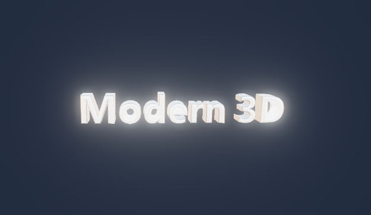

# Modern 3D Text

Reescrita moderna do screensaver clássico "Texto 3D" do Windows. Nativo,
leve, OpenGL 3.3.

**Status:** Fase 4a — render **HDR** (alvo RGBA16F multisample) + **bloom**
(pirâmide de mips com bright-pass e upsample tent) + **tonemap ACES** filmic, com
a aba **Efeitos** na config (ligar/desligar bloom, limiar, intensidade,
espalhamento). O modo preview (`/p` do painel) roda só resolve + tonemap, sem
bloom. Antes: **bevel** (sombreado por SDF / geométrico / desligado) + micro-bevel
+ **casca oca** (aba Geometria); 4 materiais com ambiente refletido (procedural +
imagem equiretangular opcional); configuração pelo registro
(`HKCU\Software\Modern3DText`) + diálogo Win32 com abas
**Conteúdo / Movimento / Material / Geometria / Efeitos** e mini-preview 3D ao
vivo; texto 3D extrudado (fonte → contornos → tampa + paredes) e pêndulo limitado
das fases 2a/2b.



- Design completo: [`docs/superpowers/specs/2026-09-10-modern-3d-text-screensaver-design.md`](docs/superpowers/specs/2026-09-10-modern-3d-text-screensaver-design.md)
- Planos de implementação: [`docs/superpowers/plans/`](docs/superpowers/plans/)

## Build

Precisa do **w64devkit** (MinGW-w64 portátil, sem instalador):

1. Baixe de <https://github.com/skeeto/w64devkit/releases> e extraia em qualquer
   pasta (ex.: `C:\w64devkit` ou `C:\Users\<você>\w64devkit`).
2. Rode `w64devkit.exe` (abre um shell com `gcc`/`make`/`windres`/`gdb` no PATH),
   ou adicione `<pasta>\bin` ao seu PATH — o `gcc` precisa achar `as` e `ld`.
3. Na raiz do projeto:
   ```sh
   mingw32-make -f build/Makefile          # release -> dist/Modern3DText.scr
   mingw32-make -f build/Makefile debug
   mingw32-make -f build/Makefile test      # testes unitários
   mingw32-make -f build/Makefile run        # roda /s
   mingw32-make -f build/Makefile config     # roda /c
   ```

Versão do toolchain testada: ver [`toolchain.txt`](toolchain.txt).

## Instalar para testar

Copie `dist/Modern3DText.scr` para `C:\Windows\System32\` (precisa de admin), ou
clique com o botão direito no arquivo e escolha **Instalar** / **Testar**.

## Licença

MIT — ver [`LICENSE`](LICENSE).
