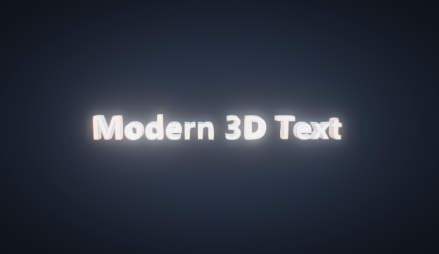

# 3D Text+

Reescrita moderna do screensaver clássico "Texto 3D" do Windows. Nativo,
leve, OpenGL 3.3.

**Status:** Fase 4d — **aberração cromática**, **vinheta** e **FXAA**, os 3
com toggle individual numa **7ª aba "Pós"** no diálogo. Fecha o §8.1 do
spec: a cadeia de pós-processamento agora tem os 10 passos completos (cena →
bloom → streaks → combinar → aberração cromática → vinheta → tonemap ACES →
FXAA). CA e vinheta agem antes do tonemap (deslocamento de UV radial em R/G/B
e escurecimento multiplicativo nas bordas, respectivamente); FXAA é o último
passe, pós-tonemap. Nenhum dos 3 entra no ladder de qualidade automática (são
baratos) — mas, como bloom e streaks, ficam desligados no modo preview (`/p`)
e no nível de GPU reduzido. Antes: Fase 4c — **streaks de difração** na aba
Efeitos: *starburst* (estrela de 6 pontas) e *anamórfico* (faixa horizontal
azulada), selecionáveis e desligados por padrão, com o degrau "streaks off" no
topo da escada de qualidade automática. Fase 4b — **níveis de qualidade**
(cheio / reduzido, com detecção de GPU de software / WARP / RDP e override
`M3DT_FORCE_TIER`), **escala de render** (renderiza numa fração da resolução e
faz upscale no passe final), **VSync** e **limite de FPS** configuráveis, e
**qualidade automática**: mede o tempo de GPU por frame (`GL_TIME_ELAPSED`) e
degrada em degraus com histerese quando a GPU não sustenta ~45 fps. Fase 4a —
render **HDR** + **bloom** + **tonemap ACES** filmic; **bevel** (sombreado por
SDF / geométrico / desligado) + micro-bevel + **casca oca** (aba Geometria); 4
materiais com ambiente refletido (procedural + imagem equiretangular
opcional); configuração pelo registro (`HKCU\Software\Modern3DText`) +
diálogo Win32 com abas **Conteúdo / Movimento / Material / Geometria /
Efeitos / Desempenho / Pós** e mini-preview 3D ao vivo; texto 3D extrudado
(fonte → contornos → tampa + paredes) e pêndulo limitado das fases 2a/2b.



- Design completo: [`docs/superpowers/specs/2026-09-10-modern-3d-text-screensaver-design.md`](docs/superpowers/specs/2026-09-10-modern-3d-text-screensaver-design.md)
- Planos de implementação: [`docs/superpowers/plans/`](docs/superpowers/plans/)

## Build

Precisa do **w64devkit** (MinGW-w64 portátil, sem instalador):

1. Baixe de <https://github.com/skeeto/w64devkit/releases> e extraia em qualquer
   pasta (ex.: `C:\w64devkit` ou `C:\Users\<você>\w64devkit`).
2. Rode `w64devkit.exe` (abre um shell com `gcc`/`make`/`windres`/`gdb` no PATH),
   ou adicione `<pasta>\bin` ao seu PATH — o `gcc` precisa achar `as` e `ld`.
3. Na raiz do projeto:
   ```sh
   mingw32-make -f build/Makefile          # release -> dist/Modern3DText.scr
   mingw32-make -f build/Makefile debug
   mingw32-make -f build/Makefile test      # testes unitários
   mingw32-make -f build/Makefile run        # roda /s
   mingw32-make -f build/Makefile config     # roda /c
   ```

Versão do toolchain testada: ver [`toolchain.txt`](toolchain.txt).

## Instalar para testar

Copie `dist/Modern3DText.scr` para `C:\Windows\System32\` (precisa de admin), ou
clique com o botão direito no arquivo e escolha **Instalar** / **Testar**.

## Licença

MIT — ver [`LICENSE`](LICENSE).
